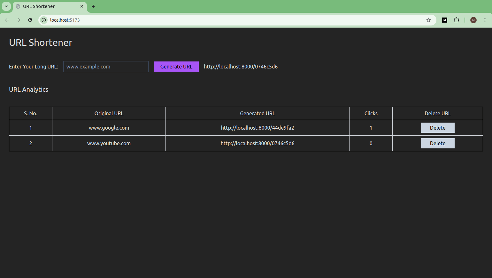

# 🌐 URL Shortener

A simple and efficient URL shortening web application built with React.js, Node.js, Express, and MongoDB. This service allows users to shorten long URLs, track visits, and redirect to the original URLs seamlessly.

## Features

- 🔗 **Shorten URLs**: Convert long URLs into short, easily shareable links.

- 📊 **Visit Tracking**: Track the visit history with timestamps.

- 🔄 **URL Redirection**: Automatically redirect users from the shortened URL to the original URL.

- 📥 **Database Support**: Uses MongoDB to store shortened URLs and track visit history.

## Tech Stack

- **Backend**: Node.js, Express

- **Database**: MongoDB

- **Frontend**: TailwindCSS, ReactJS

- **Version Control**: Git, Github

## Installation and Setup

1. Clone the repository:

   ```bash
   git clone https://github.com/nachatra-sharma/url-shortener.git
   ```

2. Navigate to the project directory:

   ```bash
   cd url-shortener
   ```

3. Navigate to the Frontend:

   ```bash
   cd frontend
   ```

4. Install dependencies:

   ```bash
   npm install
   ```

5. Navigate to the Backend:

   ```bash
   cd backend
   ```

6. Install dependencies:

   ```bash
   npm install
   ```

7. Create a .env file in the root of the backend dir and add the following environment variables:

   ```bash
   MONGO_URI=<Your MongoDB connection string>
   PORT=3000
   ```

8. Start frontend and backend both:

   ```bash
   npm run dev
   ```

## Future Enhancements

- 🔐 **User Authentication**: Allow users to create accounts and manage their shortened URLs.

- 📈 **Analytics**: Display analytics,such as geographic data of visitors.

- 🔗 **Custom Short Links**: Let users create custom short URLs (e.g., http://short.ly/my-link).

## How It Works

1. **Shortening a URL**: Users can provide a long URL through the frontend or API, and the app will generate a unique shortID that maps to the original URL.

2. **Redirecting**: When a user visits the shortened URL (e.g., http://localhost:3000/abc123), the app looks up the corresponding original URL and redirects the user to it.

3. **Tracking**: Every time a user visits a shortened URL, the visit is recorded with a timestamp in the visitHistory field of the database.

## API Documentation

- **POST /create**: Create a new shortened URL

- **DELETE /delete/:id**: Delete a shortened URL

- **GET /**: Get all the URL

- **GET /:id**: Redirects to the original URL and logs the visit

## Image


